# Monitoring the 2019 Short-Term Rental Ordinance in Boston, MA

Capstone project by Joe Fitzgerald Data Science Immersive, General Assembly   DSI-10-BOS |  Will Sutton & Teng Mao

<a href='http://jsfitz.pythonanywhere.com/'>
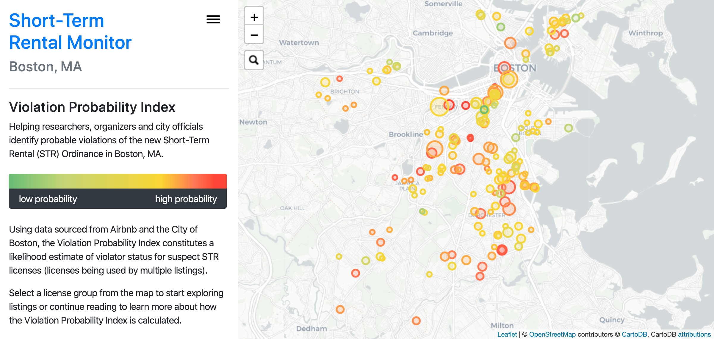
<h4>View App ▶︎</h4>
 </a>

### Contents:

1. [**Background**](#1-background)
2. [**Project Overview**](#2-project-overview)
3. [**Source Details**](#3-data)
4. [**Mapping & Analysis**](#4-mapping--analysis)

## 1. Background

Housing costs across Boston have been skyrocketing: between 2005 and 2017, median rent prices in the city [increased 55%](https://cssh.northeastern.edu/policyschool/wp-content/uploads/sites/24/2017/11/Housing-Report-Card-2017_FinalProof.pdf), with some neighborhoods seeing price hikes of more than 80% over the same period. Statewide, the number of evictions [doubled](https://boston.curbed.com/2019/2/20/18232604/massachusetts-legal-aid-evictions) between 2005 and 2016—for an average of 43 evictions a day in Massachusetts in 2016 according to the [Eviction Lab](https://evictionlab.org/map/#/2016?geography=counties&bounds=-75.176,40.52,-66.634,43.967&type=er&locations=25025,-71.057,42.339) at Princeton University.

**Consumer Price Index for Rent of Primary Residence in Boston-Cambridge-Newton:**
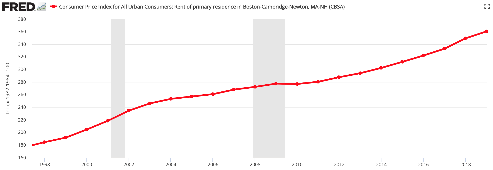</img>
source: [Federal Reserve Bank](https://fred.stlouisfed.org/series/CUUSA103SEHA#0)

Lawmakers on Beacon Hill have attempted [repeatedly](https://www.wbur.org/radioboston/2016/03/15/boston-debates-just-cause) to mitigate the negative impacts of rising prices on low-income residents, with legislation aimed at tracking evictions as well as a "just cause" ordinance introduced in 2015 to "require corporate landlords to have a reason to evict a tenant at will," ([source](https://www.wbur.org/radioboston/2015/12/15/landlords-just-cause)). But these efforts have [largely failed](https://www.wbur.org/radioboston/2018/05/16/jim-brooks-housing-act-recap) to aid in increasing affordability, while evictions data since 2016 remains hard to find.

</img>

[Multiple](http://www.sharebetter.org/wp-content/uploads/2018/01/High-Cost-Short-Term-Rentals.pdf) [studies](https://www.citylab.com/equity/2019/02/study-airbnb-cities-rising-home-prices-tax/581590/) published in the last five years have shown a link between Airbnb and rising rental prices.
According to the Economic Policy Institute, "High-quality studies indicate that Airbnb introduction and expansion in New York City, for example, may have raised average rents by nearly $400 annually for city residents." ([source]((https://www.epi.org/publication/the-economic-costs-and-benefits-of-airbnb-no-reason-for-local-policymakers-to-let-airbnb-bypass-tax-or-regulatory-obligations/)))

In 2016, researchers at UMass Boston [found](http://repec.umb.edu/RePEc/files/2016_03.pdf) that in Boston census tracts with the highest concentration of Airbnb listings, a one-standard-deviation increase in the number of Airbnb listings relative to the total number of housing units was associated with an increase of as much as $93 in the mean monthly asking rent. Based on this conclusion, the authors stated:
> **"Boston’s mean asking rents in January 2019 would be as much as $178/month higher than in the absence of Airbnb activity."**

</img>

Under [pressure](https://www.bostonglobe.com/business/2017/10/05/housing-advocates-say-airbnb-rentals-are-replacing-chinatown-apartments/Z9KwIgppY89rHbbflvKC6H/story.html) from housing affordability advocacy groups, in June 2018 Mayor Marty Walsh signed a [**Short-Term Rental Ordinance**](](https://www.wbur.org/bostonomix/2018/06/13/airbnb-boston-council-proposal-vote)) aimed at curbing the abuse of platforms like Airbnb by corporate third-party operators. The ordinance limits residential short-term rentals to owner-occupied and owner-adjacent units, requires owners to register with the city, and imposes a $200 fine per night per unit for unregistered listings.

###### Airbnb, Inc. v. City of Boston

Airbnb [sued](https://www.wbur.org/bostonomix/2018/11/13/airbnb-boston-lawsuit) Boston over the ordinance, claiming that it violates Section 230 of the **Communications Decency Act**. For the system to work, Airbnb would have to supply the city of Boston with proprietary data and possibly to build enforcement mechanisms into its service.

Passed in 1996, CDA § 230 provides internet platforms services with broad immunities from the activities of their users: "No provider or user of an interactive computer service shall be treated as the publisher or speaker of any information provided by another information content provider." ([47 U.S.C. § 230](https://www.law.cornell.edu/uscode/text/47/230))

Websites like Facebook and Youtube [depend heavily]((https://airbnbwatch.org/big-tech-rental-platforms-exploit-cda-230-to-shield-illegal-activity//)) on CDA 230 to claim protection from user-generated content, allowing companies to  effectively renounce legal responsibility for what happens on digital platforms. In its lawsuit, Airbnb sought to extend this immunity over the facilitation of rental transactions, calling itself a "[bulletin board service](https://d279m997dpfwgl.cloudfront.net/wp/2018/11/AIRBNB-BOSTON-LAWSUIT.pdf)" for rental transactions rather than a real estate broker.
##### <blockquote> Big Tech rental platforms, especially Airbnb and HomeAway, are shamefully exploiting CDA 230 to shield illegal rentals on their websites and stealing affordable housing options away from hard-working families, while padding their corporate profits off this illegal activity.
</blockquote>
&nbsp;&nbsp;&nbsp;&nbsp; — <a href='https://airbnbwatch.org/big-tech-rental-platforms-exploit-cda-230-to-shield-illegal-activity/'>AirbnbWATCH</a>

###### Settlement

In August [Airbnb settled](https://www.avalara.com/mylodgetax/en/blog/2019/09/boston-airbnb-hosts-must-register-with-city-by-december-under-lawsuit-settlement.html), agreeing to share listings data with the city and to require users to include registration numbers with all listings after December 2019. Furthermore based on a "Fairness Across Platforms" provision in the settlement, the city started working on comparable databases and regulatory frameworks for Airbnb's competitors.

</img>

##### Conclusion

The City of Boston started accepting applications from prospective renters under the new Short-Term Rental ordinance on January 1, 2019. After an 11-month grace period, the ordinance went into full effect on December 1.

## 2. Project Overview
###### Questions & goals:

How has the new Ordinance affected Airbnb in Boston?  
- Track Airbnb listings through time using data from InsideAirbnb.com

Do listing registration numbers on Airbnb's website match  official city data?  
- Compare counts of listings and registrations within city parcels between different datasets

How effective has enforcement of the new ordinance been so far? 
- Use link features and de-anonymization strategies to locate potential unidentified violations

## 3. Data

I accumulated data from multiple sources including the Boston Area Research Initiative (BARI), the City of Boston, Inside Airbnb and others. This section provides an overview of each of the datasets, their key features, plus the 'link features' used to match corresponding buildings & units across datasets.

<a href='#airbnb-data'>Airbnb data<a> | <a href='#city-of-boston-data'>City of Boston Data</a> | <a href='#property-assessment-data'>Property Assessment Data</a> | <a href='#padmapper-data'>Padmapper data</a>

### Airbnb data
</img>

Brooklyn-based data activist [Murray Cox](https://www.bloomberg.com/news/articles/2019-05-23/meet-murray-cox-airbnb-s-public-enemy-no-1-in-new-york) began scraping airbnb.com in 2015 to highlight illegal listings in New York City, and he publishes the data collected on hundreds of cities through the [Inside Airbnb](http://insideairbnb.com) website. With funding from the hotel trade association, the city of San Francisco and other researchers, the project provides a "fair and accurate representation" of Airbnb's activities according to David Wachsmuth, a professor at the McGill University School of Urban Planning.

#####  <code><b>airbnb.csv</b></code>

- **source**: 23 merged scrape files from  [insideairbnb.com](http://insideairbnb.com/get-the-data.html) (629 mb)
- **124,730** rows x **31** columns (after cleaning)\*
- **key features**:
    - `price`
    - `license`
    - `host_distance_km` (calculated, approx)
    

show all

      <li><code>id</code></li>
      <li><code>scrape_id</code></li>
      <li><code>host_id</code></li>
      <li><code>host_listings_count</code></li>
      <li><code>host_total_listings_count</code></li>
      <li><code>latitude</code></li>
      <li><code>longitude</code></li>
      <li><code>accommodates</code></li>
      <li><code>bathrooms</code></li>
      <li><code>bedrooms</code></li>
      <li><code>beds</code></li>
      <li><code>price</code></li>
      <li><code>guests_included</code></li>
      <li><code>minimum_nights</code></li>
      <li><code>maximum_nights</code></li>
      <li><code>availability_30</code></li>
      <li><code>availability_60</code></li>
      <li><code>availability_90</code></li>
      <li><code>availability_365</code></li>
      <li><code>number_of_reviews</code></li>
      <li><code>calculated_host_listings_count</code></li>
      <li><code>host_age</code> (calculated)</li>
      <li><code>has_license</code></li>
      <li><code>exempt_license</code></li>
      <li><code>host_lat</code></li>
      <li><code>host_lng</code></li>
      <li><code>host_distance_km</code> (calculated)</li>
- **link features**:
    - `id`
    - `latitude` & `longitude` (anonymized up to 450 feet)

\* I removed listings with minimum stays of greater than 28 days, zero availability over the next 365 days, and those located outside Boston city limits.

I created a function to iterate forward through scrapes, returning a count of new listing Ids vs. familiar listings Ids (presumably the same listing seen in a previous scrape). Plotting these results demonstrates the month-to-month turnover in listings and shows the year-to-year growth in total count leading up to mid-2018. The impact of the Short-Term Rental Ordinance is also clear in the significant drop-off between November and December of 2019, when in a span of two weeks 2,758 unique listings were removed from Airbnb's website.

<a href='https://plot.ly/~3joemail/7.embed'>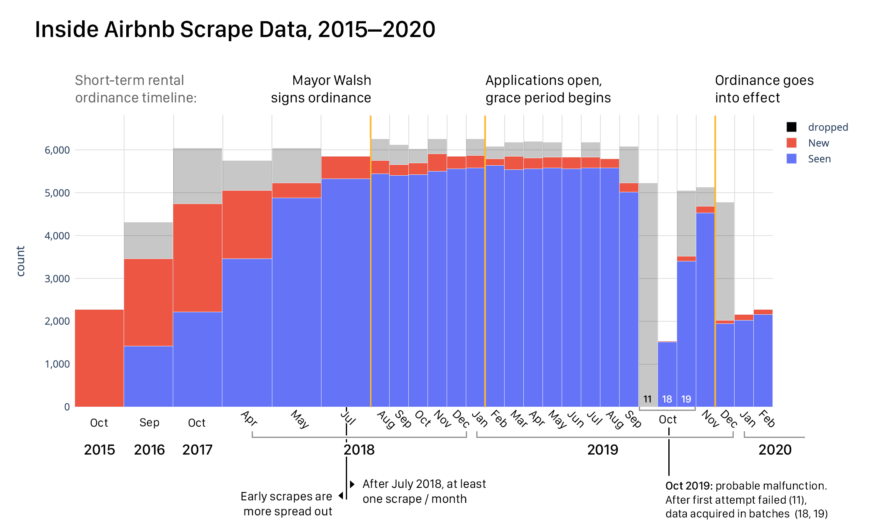</img></a>

The sum of the blue and red bars equates to the total number of listings present for a given date while the gray bars represent listings that appeared in the previous scrape but do not appear in the given scrape's data ("dropped" since the previous month). These counts are based on listings with unique values in the `id` column after duplicates (multiple `id`s pointing to the same `listing_url`) were removed. [Click here](https://plot.ly/~3joemail/7.embed) to see an interactive version of this plot.

Interestingly the total number of listings began to drop off as early as September 2019, three months before the ordinance went into effect. The anomaly in October 2019 also remains unexplained. I speculate that Airbnb made significant changes to its website, either intentionally or unintentionally temporarily thwarting the Inside Airbnb scraping algorithm. A reasonable scrape was apparently achieved by collecting segments of about 1/3 and then 2/3 of the data on October 18th and 19th after the first attempt of that month failed.

###  City of Boston Data

</img>

I obtained three primary datasets from the City of Boston, two from data.boston.gov and one sent via email from the Department of Innovation and Technology, to establish a unified working source of information on citywide short-term rental statistics.

The combined Short-Term-Rental (STR) dataset uses a feature-name prefix structure to indicate the source of the data in each column, allowing other researchers to use my aggregated dataset with confidence in the origin of various data points.

| <code style='color:green;font-size:18px'><b>SAMREF.csv</b></code>   Street Address Management | <code style='color:royalblue;font-size:18px'><b>STRE.csv</b></code>  (Public) STR Dataset | <code style='color:purple;font-size:18px'><b>STR_apps.csv</b></code> STR Applications |
|---|---|---|
|Boston maintains the Street Address Management (SAM) index to identify units across the city. With well-recorded address parameters and accurate GPS coordinates for each unit, this reference data provides a crucial link between other datasets.|In accordance with the new Short-Term Rental Ordinance, the city hosts a public registry online, updated nightly according to its website. The registry is indexed by SAM_ID, meaning each row corresponds to one unit. |An employee at the Department of Innovation and Technology emailed me an STR applications tracking document updated on February 20th, 2020. She indicated that it should be public information.* |
|[data.boston.gov](https://data.boston.gov/dataset/live-street-address-management-sam-addresses) (78.6 mb)|[data.boston.gov](https://data.boston.gov/dataset/short-term-rental-eligibility/resource/83621b97-9a00-4aa7-bf43-28cae04969d4) (23.4 mb)|[DoIT](https://www.boston.gov/departments/innovation-and-technology) (300 kb)|
|**396,462** rows x **43** columns (after cleaning)|**396,462** rows x **16** columns (after cleaning)|**2,127** rows x **25** columns|
|**key features**:<li>`SAM_ID`</li><li>`SAM_UNIT`</li>

show all (43)
<li><code>SAM_longitude</code></li><li><code>SAM_latitude</code></li><li><code>SAM_RELATIONSHIP_TYPE</code></li><li><code>SAM_BUILDING_ID</code></li><li><code>SAM_FULL_ADDRESS</code></li><li><code>SAM_STREET_NUMBER</code></li><li><code>SAM_IS_RANGE</code></li><li><code>SAM_RANGE_FROM</code></li><li><code>SAM_RANGE_TO</code></li><li><code>SAM_UNIT</code></li><li><code>SAM_FULL_STREET_NAME</code></li><li><code>SAM_STREET_ID</code></li><li><code>SAM_STREET_PREFIX</code></li><li><code>SAM_STREET_BODY</code></li><li><code>SAM_STREET_SUFFIX_ABBR</code></li><li><code>SAM_STREET_FULL_SUFFIX</code></li><li><code>SAM_STREET_SUFFIX_DIR</code></li><li><code>SAM_STREET_NUMBER_SORT</code></li><li><code>SAM_MAILING_NEIGHBORHOOD</code></li><li><code>SAM_ZIP_CODE</code></li><li><code>SAM_X_COORD</code></li><li><code>SAM_Y_COORD</code></li><li><code>SAM_SAM_STREET_ID</code></li><li><code>SAM_WARD</code></li><li><code>SAM_PRECINCT_WARD</code></li><li><code>SAM_PARCEL</code></li>|**key features**:<li>`issued_registration`</li><li>`open violations count`</li>

show all (16)
<li><code>sam_address</code></li><li><code>home-share eligible</code></li><li><code>limited-share eligible</code></li><li><code>owner-adjacent eligible</code></li><li><code>owners_current_license_types</code></li><li><code>income restricted</code></li><li><code>problem property</code></li><li><code>problem property owner</code></li><li><code>open violation count</code></li><li><code>legally restricted</code></li><li><code>building owner-occupied</code></li><li><code>units in building</code></li><li><code>building single owner</code></li>|**key features**:<li>`status`</li><li>`issued date`</li>

show all (25)
<li><code>License #</code></li><li><code>Type</code></li><li><code>Status</code></li><li><code>First Name</code></li><li><code>Last Name</code></li><li><code>Address</code></li><li><code>Issued Date</code></li><li><code>Renewal Date</code></li><li><code>Expire Date</code></li><li><code>Grace Expiration Date</code></li><li><code>Priority</code></li><li><code>Category</code></li><li><code>Business Name</code></li><li><code>DBA</code></li><li><code>Milestone</code></li><li><code>Last Renewed</code></li><li><code>Last Modified</code></li>|
|**link features**:<li>`SAM_ADDRESS`</li><li>`SAM_latitude`</li><li>`SAM_longitude`</li>|**link features**:<li>`sam_ID`</li><li>`sam_address`</li><li>`units in building`</li>|**link features**:<li>`address`</li><li>`lat`</li><li>`lng`</li>|

\* The person who sent me the data said "All of this information will be transferred to our public data set so the public can have access to it 24/7" (26 Feb 2020). Still I removed first and last names from the working data.

#### Joined STR data

The unified STR dataset combines key features from the three sources above. Both public datasets use the same index, making it easy to merge corresponding units. To identify corresponding units  between  <code><b>STR_apps</b></code> and  <code><b>STRE</b>+ <b>SAMREF</b></code>, I used a combination of geographic distances according to a Google Maps geocode and the [Jaro similarity](https://en.wikipedia.org/wiki/Jaro%E2%80%93Winkler_distance) of written addresses. All registered listings in  <code><b>STRE</b></code> were merged onto the highest-scoring application row for these factors (above a minimum threshold), with   <code><b>SAMREF</b></code> geometry replacing the information geocoded from addresses in  <code><b>STR_apps</b></code>.

- **sources**:  <code><b>STR_apps</b></code> +  <code><b>STRE</b></code> +  <code><b>SAMREF</b></code>
- **2,065** rows x **64** columns (after cleaning)
- **key features**:
   - From  <code><b>STR_apps.csv</b></code>:
       - `APP_License #`
       - `APP_Status`
       - `APP_Issued Date`
   - From  <code><b>STRE.csv</b></code> (public):
       - `PSD_issued_registration`
       - `PSD_open violation count`
       - `PSD_unit owner-occupied`
   - From  <code><b>SAMREF.csv</b></code>:
       - `SAM_PARCEL` (land parcel ID)
       - `SAM_longitude`
       - `SAM_latitude`
- 

show all (64)

     <li><code>APP_License #</li></code><li><code>APP_Type</li></code><li><code>APP_Status</li></code><li><code>APP_Address</li></code><li><code>APP_Issued Date</li></code><li><code>APP_Renewal Date</li></code><li><code>APP_Expire Date</li></code><li><code>APP_Grace Expiration Date</li></code><li><code>APP_Priority</li></code><li><code>APP_Category</li></code><li><code>APP_Business Name</li></code><li><code>APP_DBA</li></code><li><code>APP_Milestone</li></code><li><code>APP_Last Renewed</li></code><li><code>APP_Last Modified</li></code><li><code>PSD_issued_registration</li></code><li><code>PSD_sam_address</li></code><li><code>PSD_home-share eligible</li></code><li><code>PSD_limited-share eligible</li></code><li><code>PSD_owner-adjacent eligible</li></code><li><code>PSD_owners_current_license_types</li></code><li><code>PSD_income restricted</li></code><li><code>PSD_problem property</li></code><li><code>PSD_problem property owner</li></code><li><code>PSD_open violation count</li></code><li><code>PSD_violations in the last 6 months</li></code><li><code>PSD_legally restricted</li></code><li><code>PSD_unit owner-occupied</li></code><li><code>PSD_building owner-occupied</li></code><li><code>PSD_units in building</li></code><li><code>PSD_building single owner</li></code><li><code>SAM_longitude</li></code><li><code>SAM_latitude</li></code><li><code>SAM_RELATIONSHIP_TYPE</li></code><li><code>SAM_BUILDING_ID</li></code><li><code>SAM_FULL_ADDRESS</li></code><li><code>SAM_STREET_NUMBER</li></code><li><code>SAM_IS_RANGE</li></code><li><code>SAM_RANGE_FROM</li></code><li><code>SAM_RANGE_TO</li></code><li><code>SAM_UNIT</li></code><li><code>SAM_FULL_STREET_NAME</li></code><li><code>SAM_STREET_ID</li></code><li><code>SAM_STREET_PREFIX</li></code><li><code>SAM_STREET_BODY</li></code><li><code>SAM_STREET_SUFFIX_ABBR</li></code><li><code>SAM_STREET_FULL_SUFFIX</li></code><li><code>SAM_STREET_SUFFIX_DIR</li></code><li><code>SAM_STREET_NUMBER_SORT</li></code><li><code>SAM_MAILING_NEIGHBORHOOD</li></code><li><code>SAM_ZIP_CODE</li></code><li><code>SAM_X_COORD</li></code><li><code>SAM_Y_COORD</li></code><li><code>SAM_SAM_STREET_ID</li></code><li><code>SAM_WARD</li></code><li><code>SAM_PRECINCT_WARD</li></code><li><code>SAM_PARCEL</li></code>

#### Outdated public records:

Exploratory analysis on the combined STR dataset revealed  discrepancies between the public registry and the internal applications tracker emailed by the DoIT. While the public dataset contains only **629** units marked `Y` for `issued_registration`, the application data indicates a total of **943** `Active` units according to the `Status` column. I obtained both datasets within less than a week of each other, so the variations suggest that the public dataset is not updated as frequently as claimed on data.boston.gov (nightly).

- <b>blue</b>: `issued_registration` = `Y` listings according to  <code><b>STRE.csv</b></code> (public dataset)
    - Downloaded from boston.gov on **2/22/2020**
    - GPS coordinates linked from  <code><b>SAMREF.csv</b></code>  
- <b>red</b>: `Status` = `Active` listings according to  <code><b>STR_apps.csv</b></code>
    - Emailed from DoIT on **2/20/2020**
    - Addresses geocoded to GPS coordinates using  <code><b>Google Maps API</b></code>  

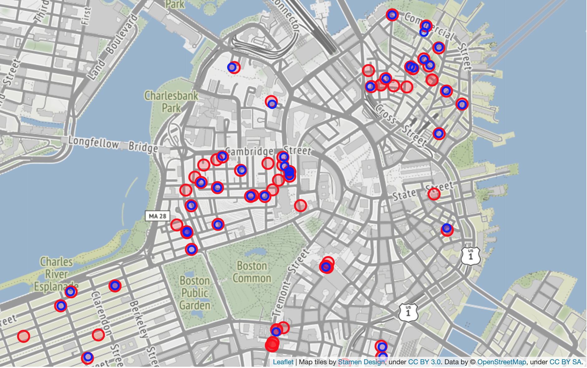</img>

The map also illustrates how Google Maps-geocoded  <code><b>STR_apps</b></code> locations were matched to rows in the  <code><b>STRE</b></code> data. In cases where many listings appear in close proximity, the matching function reverts to [Jaro](https://pypi.org/project/pyjarowinkler/) to identify the correct unit in a building. All but four `issued_registration` listings in  <code><b>STRE</b></code> succesfuly found a match in the  <code><b>STR_apps</b></code> data, and I manually located matches for the remaining rows.

###  Property Assessment Data
</img>

The Boston Area Research Initiative (BARI) is an "[interuniversity partnership](https://www.boston.gov/civic-engagement/boston-area-research-initiative)" between Northeastern University and Harvard University founded by the City of Boston in 2011, using data to inform public policy and to advance urban development research. Since 2017 the organization has released [yearly amendments](https://dataverse.harvard.edu/dataset.xhtml?persistentId=doi:10.7910/DVN/UWTQ4E) to the City of Boston's [Property Assessment data](https://data.boston.gov/dataset/property-assessment), detailed tax information on every city property.

The BARI version of Boston's Property Assessment data includes 18 additional variables, from the type of business at an address to a simplified index of zoning categories. Researchers at BARI also imputed more than 50% of the values in column that describe the number of units in a building.

#####  <code><b>bari_props_2019.csv</b></code>

- **source**: PADCross.Record.2019.tab (78.9 mb) | [Boston Area Research Initiative](https://dataverse.harvard.edu/file.xhtml?persistentId=doi:10.7910/DVN/YVKZIG/PZZMOO&version=1.0)
    <blockquote>This file is the cross-sectional 2019 property assessment data at the parcel level</blockquote>
- **174,074** rows x **94** columns
- **key features**:
    - `LU` (land use)
    - `S_UNIT_{r/c/m}` (number of residential/commercial/mixed units in building)
    - `OWN_OCC` (owner-occupied)
    

show all (94)

    <li><code>PID</li></code><li><code>CM_ID</li></code><li><code>GIS_ID</li></code><li><code>ST_NUM</li></code><li><code>ST_NAME</li></code><li><code>ST_NAME_SUF</li></code><li><code>UNIT_NUM</li></code><li><code>ZIPCODE</li></code><li><code>PTYPE</li></code><li><code>LU</li></code><li><code>OWN_OCC</li></code><li><code>OWNER</li></code><li><code>MAIL_ADDRESSEE</li></code><li><code>MAIL_ADDRESS</li></code><li><code>MAIL.CS</li></code><li><code>MAIL_ZIPCODE</li></code><li><code>AV_LAND</li></code><li><code>AV_BLDG</li></code><li><code>AV_TOTAL</li></code><li><code>GROSS_TAX</li></code><li><code>LAND_SF</li></code><li><code>YR_BUILT</li></code><li><code>YR_REMOD</li></code><li><code>GROSS_AREA</li></code><li><code>NUM_FLOORS</li></code><li><code>STRUCTURE_CLASS</li></code><li><code>R_BLDG_STYL</li></code><li><code>R_ROOF_TYP</li></code><li><code>R_EXT_FIN</li></code><li><code>R_TOTAL_RMS</li></code><li><code>R_BDRMS</li></code><li><code>R_FULL_BTH</li></code><li><code>R_HALF_BTH</li></code><li><code>R_BTH_STYLE</li></code><li><code>R_BTH_STYLE2</li></code><li><code>R_BTH_STYLE3</li></code><li><code>R_KITCH</li></code><li><code>R_KITCH_STYLE</li></code><li><code>R_KITCH_STYLE2</li></code><li><code>R_KITCH_STYLE3</li></code><li><code>R_HEAT_TYP</li></code><li><code>R_AC</li></code><li><code>R_FPLACE</li></code><li><code>R_EXT_CND</li></code><li><code>R_OVRALL_CND</li></code><li><code>R_INT_CND</li></code><li><code>R_INT_FIN</li></code><li><code>R_VIEW</li></code><li><code>S_NUM_BLDG</li></code><li><code>S_BLDG_STYL</li></code><li><code>S_UNIT_RES</li></code><li><code>S_UNIT_COM</li></code><li><code>S_UNIT_RC</li></code><li><code>S_EXT_FIN</li></code><li><code>S_EXT_CND</li></code><li><code>U_BASE_FLOOR</li></code><li><code>U_NUM_PARK</li></code><li><code>U_CORNER</li></code><li><code>U_ORIENT</li></code><li><code>U_TOT_RMS</li></code><li><code>U_BDRMS</li></code><li><code>U_FULL_BTH</li></code><li><code>U_HALF_BTH</li></code><li><code>U_BTH_STYLE</li></code><li><code>U_BTH_STYLE2</li></code><li><code>U_BTH_STYLE3</li></code><li><code>U_KITCH_TYPE</li></code><li><code>U_KITCH_STYLE</li></code><li><code>U_HEAT_TYP</li></code><li><code>U_AC</li></code><li><code>U_FPLACE</li></code><li><code>U_INT_FIN</li></code><li><code>U_INT_CND</li></code><li><code>U_VIEW</li></code><li><code>LIVING_AREA</li></code><li><code>AV_BLDG_PER_SF</li></code><li><code>AV_LAND_PER_SF</li></code><li><code>SIMPLIFIED_LU</li></code><li><code>COOL_SCORE</li></code><li><code>AGE_SCORE</li></code><li><code>HEAT_SCORE</li></code><li><code>EE_SCORE</li></code><li><code>BLDG_AGE</li></code><li><code>X</li></code><li><code>Y</li></code><li><code>Land_Parcel_ID</li></code><li><code>TLID</li></code><li><code>Blk_ID_10</li></code><li><code>BG_ID_10</li></code><li><code>CT_ID_10</li></code><li><code>unit_N</li></code><li><code>unit_N_orig</li></code><li><code>GROSS_AREA_org</li></code><li><code>LIVING_AREA_org</li></code>
- **link features**:
    - `PID` (land parcel ID)
    - `MAIL_ADDRESS`
    - `X` & `Y` (latitude & longitude)

#### Link feature map
The graphic below depicts the "link features" used to associate corresponding rows between primary datasets. Dashed red connections represent conflicting series that should theoretically be the same but differ significantly.

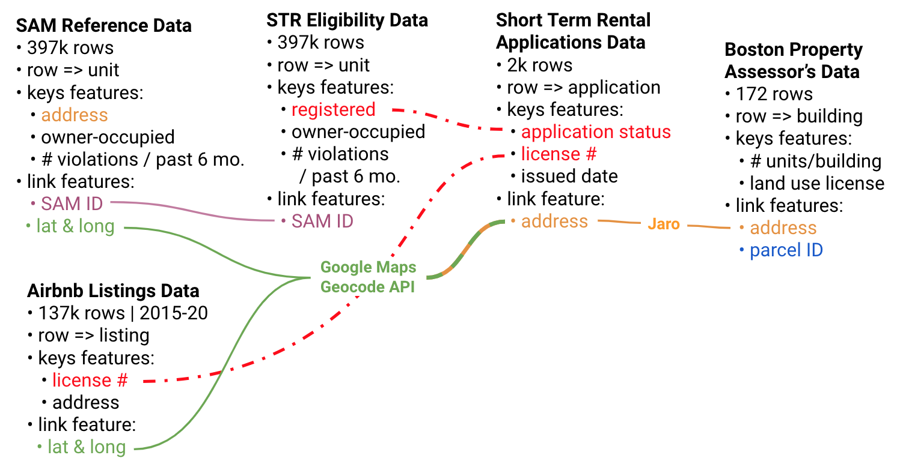</img>

###  Padmapper Data
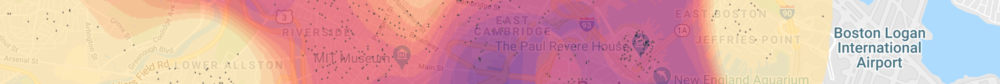</img>

Jeff Kaufman's [Boston rentals price map](https://www.jefftk.com/apartment_prices/index#2020-03-20&2) is an insightful tool for visualizing changes in asking rates over time across Boston. The data is [fairly limited](https://www.jefftk.com/p/rent-map-data-sources) in scope according to Kaufman and others, but when I asked him about the accuracy of the data, he explained: "My samples skew high, because the bottom end isn't
advertised online, but the trend over time should still be meaningful."

#####  <code><b>padmapper.csv</b></code>

- **source**: 87 merged scrape files from [jefftk.com](https://www.jefftk.com/apartment_prices/data-listing) (47.9 mb)
- **917,948** rows x **6** columns
- **key features**:
    - `price`
    - `beds`
    - `id`
    - `scraped`
- **link features**:
    - `lat`
    - `long`

New listings appear at a higher rate in month-to-month long-term rental data than in short-term listings data, so counting "new" vs. "seen" ids across all time is too computationally expensive in this case. Instead I simply plotted the total count of listings in each scrape, demonstrating overall variability in this particular dataset.

 <a href='https://plot.ly/~3joemail/12.embed'>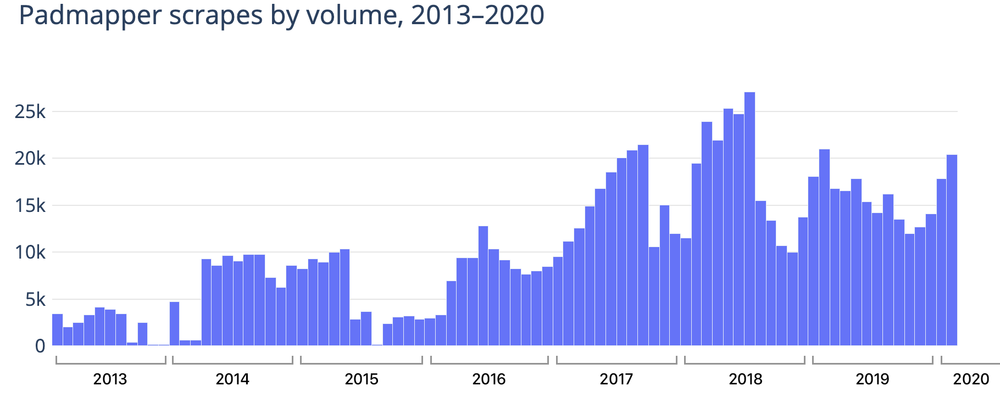</img></a>

 

Dividing the asking price by the number of bedrooms in each listing I derived an average price per bedroom for each scrape to visualize citywide trends over time (zero values are replaced with one to prevent division by zero).

<a href='https://plot.ly/~3joemail/14.embed'>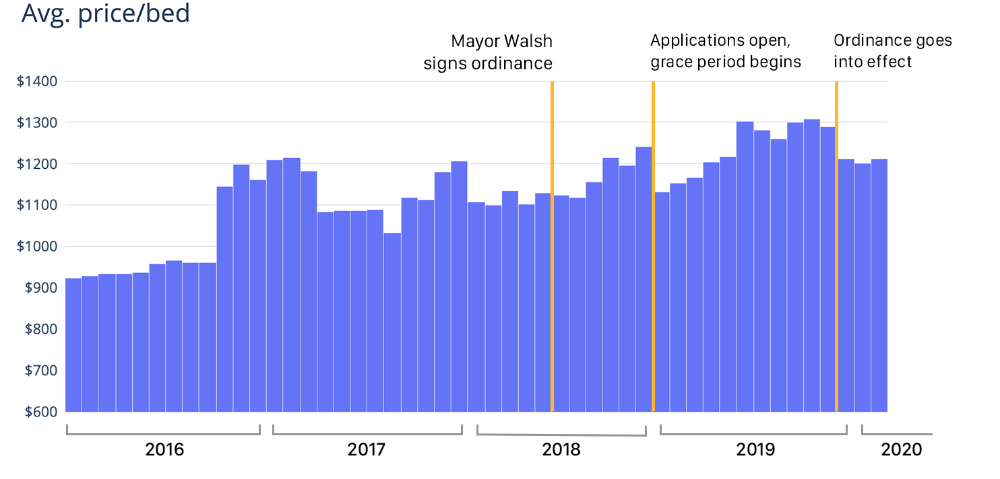</img></a>

Although average prices decreased in the months following December 1, 2019, a comparable drop in prices occurred around the same time in previous years, so it is not clear yet if the ordinance might help curb long-term rental prices in the city.

## 4. Mapping & Analysis

The final phase of this project takes the form of an <a href='http://jsfitz.pythonanywhere.com/'>interactive web application</a> designed for local officials, researchers and organizers to directly access all the information I gathered and cleaned. The entire source code for the application can be found in the `Flask App` directory under the current repository.  

#### Identifying probable violations

Using seven engineered factors with custom assigned  weights I generated a Probability Violation Index for suspicious Airbnb listings in the city — those that use duplicated license numbers. [Click here](http://jsfitz.pythonanywhere.com/#vpi-info) for details on how the VPI is calculated.

<a target='blank' href='http://jsfitz.pythonanywhere.com/analyze?license=STR-414596'>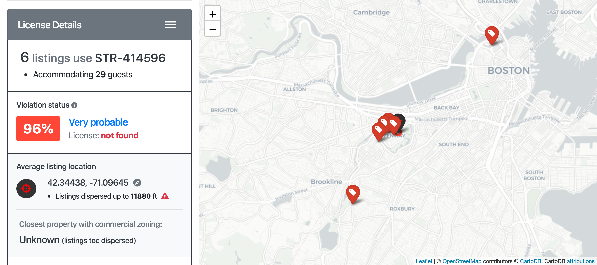</a>

The image above depicts one example of a high-probability license group, wherein four listings dispersed across the city claim to be using the same registration number. Not only are the listings too dispersed to belong together, but the license number does not appear in official city data — suggesting a license number. Below, a counter-example (click for details)

<a target='blank' href='http://jsfitz.pythonanywhere.com/analyze?license=STR-383350'>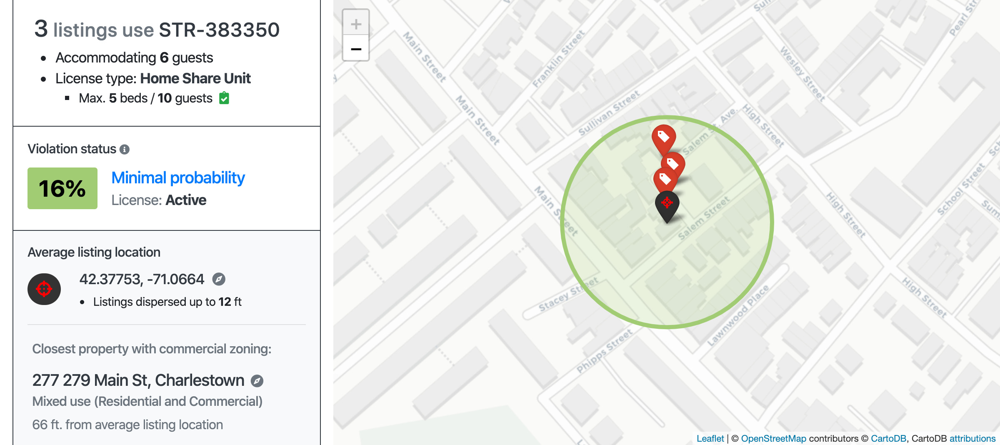</a>

## Takeaways

Based on quantity data from InsideAirbnb, the 2019 Short-Term Rental Ordinance significantly reduced the number of Airbnb listings in the city of Boston. However, my analyses show that there remain a number of listings with a high probability of violating the ordinance.

In some cases, the violation is practically blatant — for instance, where multiple listings in different city neighborhoods use the same license number, or when any listing uses a license number that doesn't appear in the official city registry. Why is it so easy to create an Airbnb listing with a fake license number? The city has made all the necessary data public for Airbnb to implement a simple automatic check. I will allow you to answer these questions on your own, and I encourage you to explore the website to discover probable violations in your neighborhood.

## Neighborhood Stats

The online STR Monitor Application also allows users to generate heatmaps for dozens of variables from the four primary datasets, grouped either by neighborhood or by census tract.

 
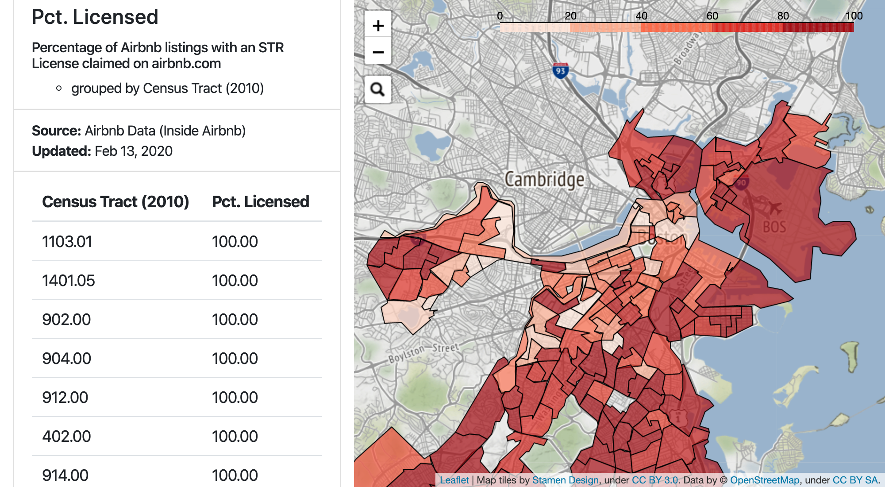
  

For sources with historical data, users may also generate their own animated heatmaps to view changes in the data over time, again by census tract or by neighborhood. For example:

 

**The STR Monitor is currently a working prototype / demo, awaiting more recent STR applications data from the City of Boston. Last updated: Feburary 22, 2020.**

Questions, comments or concerns may be directed to <a href='mailto:unofficialSTRmonitor@gmail.com'> unofficialSTRmonitor@gmail.com</a>
